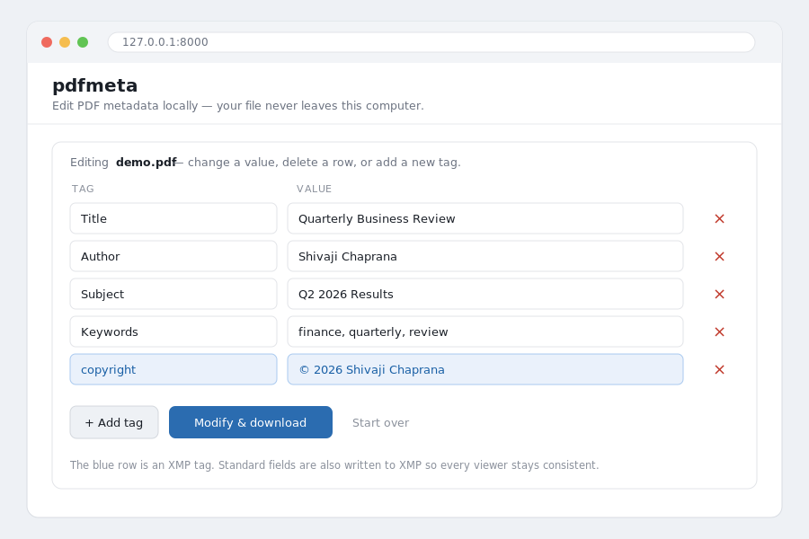

# pdfmeta

[](https://github.com/shivajichaprana/pdfmeta/actions/workflows/ci.yml)
[](https://codecov.io/gh/shivajichaprana/pdfmeta)
[](https://www.python.org/)
[](https://mypy-lang.org/)
[](https://github.com/astral-sh/ruff)
[](https://securityscorecards.dev/viewer/?uri=github.com/shivajichaprana/pdfmeta)
[](LICENSE)

A small, bulletproof command-line tool to **view and change PDF metadata** using
a simple folder + JSON workflow. Built on [`pikepdf`](https://github.com/pikepdf/pikepdf),
so it edits the PDF in place without re-rendering pages, and keeps the XMP
metadata stream in sync.

**Why pdfmeta?** Online PDF-metadata editors make you upload your file to a
stranger's server — not great for a payslip, contract, or anything private.
pdfmeta does everything **on your own machine**, works on **many PDFs at once**
from a JSON template, and reads back **every tag actually in the file** so you
can verify the result. It's tiny, typed, and thoroughly tested.

A few small commands cover the whole workflow:

- `pdfmeta view <pdf>` — show every metadata tag actually in a PDF.
- `pdfmeta run` — apply the JSON metadata from a folder to every PDF in a folder.
- `pdfmeta scrub <pdf>` — remove all metadata (before sharing a file).
- `pdfmeta gui` — a local, point-and-click browser editor.

## Installation

```bash
git clone https://github.com/shivajichaprana/pdfmeta.git
cd pdfmeta
pip install -e .            # installs pdfmeta and its one dependency (pikepdf)
```

Requires Python 3.9+. If the `pdfmeta` command isn't on your PATH, use
`python -m pdfmeta` instead — the two are equivalent.

## The workflow

Everything happens with three folders in the project:

```
input_pdf/     ← put the PDF(s) you want to tag here
input_json/    ← put your JSON metadata file here
output/        ← the tagged PDFs appear here (originals are never touched)
```

**Step 1 — check the current metadata of your PDF**

```bash
pdfmeta view input_pdf/report.pdf
```

**Step 2 — change the metadata from your JSON**

Put a single `.json` file in `input_json/` and run:

```bash
pdfmeta run
```

Each PDF in `input_pdf/` is written to `output/` with the new metadata.

**Step 3 — check the result**

```bash
pdfmeta view output/report.pdf
```

That's the whole tool. Try it now with the shipped sample:

```bash
cp examples/demo.pdf input_pdf/
cp examples/metadata.json input_json/
pdfmeta run
pdfmeta view output/demo.pdf
```

## Removing all metadata (privacy)

Before emailing or publishing a PDF, strip every tag it carries — author name,
software fingerprints, timestamps, and any hidden XMP data:

```bash
pdfmeta scrub report.pdf                 # cleans it in place
pdfmeta scrub report.pdf -o report_clean.pdf   # keeps the original, writes a clean copy
```

To scrub a whole folder at once, put an empty `{}` in a JSON file in
`input_json/` and run `pdfmeta run` — every PDF comes out with no metadata.

## The browser editor (optional)

If you'd rather click than type, install the small GUI extra and launch it:

```bash
pip install -e ".[gui]"     # adds Flask
pdfmeta gui
```

Your browser opens a local page where you can upload a PDF, see its current
metadata tags in an editable table, change values, delete tags, add new ones,
then click **Modify & download** to get the edited PDF. It runs entirely on your
machine — the file never leaves your computer, unlike online metadata editors.



## The JSON file

A flat object of `"Field": "value"` pairs. Whatever is in the JSON becomes the
PDF's metadata; by default any other existing metadata is removed so the file
matches the JSON exactly.

Don't want to write it by hand? Generate one from an existing PDF and edit it:

```bash
pdfmeta template report.pdf -o input_json/metadata.json
```

```json
{
  "Title": "Quarterly Business Review",
  "Author": "Shivaji Chaprana",
  "Subject": "Q2 2026 Financial Results",
  "Keywords": "finance, quarterly, review",
  "copyright": "© 2026 Shivaji Chaprana",
  "language": "en"
}
```

You can use the standard fields (`Title`, `Author`, `Subject`, `Keywords`,
`Creator`, `Producer`), the dates (`CreationDate`, `ModDate`), the `Trapped`
flag, rich XMP fields (`copyright`, `license`, `language`, `publisher`,
`rating`, `document-id`, and more), or any custom field name you like.

### Options for `run`

- `pdfmeta run --merge` — add/update the JSON fields but **keep** other existing
  metadata (instead of replacing everything).
- `--pdf-dir`, `--json-dir`, `--out-dir` — use different folders.

If you give each PDF its own metadata, name the JSON to match the PDF
(`report.pdf` + `report.json`); otherwise the single JSON in `input_json/` is
applied to every PDF.

## Checking metadata with `view`

`view` reads the file directly and shows **everything actually stored**, with no
guessing — the full Document Information dictionary and every XMP property,
including tags written by other tools:

```
[Document Info]
  Author    Shivaji Chaprana
  Title     Quarterly Business Review
  ...

[XMP]
  dc:title    Quarterly Business Review
  dc:creator  Shivaji Chaprana
  ...
```

Add `--json` for machine-readable output:

```bash
pdfmeta view output/report.pdf --json
```

## Project structure

```
pdfmeta/
├── src/pdfmeta/         # the package
│   ├── __init__.py      # public exports and version
│   ├── __main__.py      # enables `python -m pdfmeta`
│   ├── cli.py           # the commands (view, run, gui)
│   ├── editor.py        # core read/write engine
│   ├── batch.py         # the folder workflow
│   ├── webapp.py        # the optional browser editor
│   └── py.typed         # ships type hints (PEP 561)
├── input_pdf/           # drop PDFs here
├── input_json/          # drop JSON metadata here
├── output/              # results appear here
├── examples/            # sample demo.pdf + metadata.json
├── tests/               # pytest suite
├── .github/workflows/   # CI
├── pyproject.toml
├── README.md
├── CHANGELOG.md
├── CONTRIBUTING.md
└── LICENSE
```

## Using it as a library

The `run`/`view` commands are a thin layer over a small, well-tested engine you
can call directly:

```python
from pdfmeta import PDFMetadataEditor

with PDFMetadataEditor("report.pdf") as ed:
    print(ed.read_all())               # everything in the file
    ed.set_field("title", "Q2 Review")
    ed.set_field("copyright", "© 2026 Shivaji Chaprana")
    ed.apply_json("metadata.json")     # replace metadata to match a JSON file
    ed.save("report_tagged.pdf")
```

## Development

```bash
pip install -e ".[dev]"    # pdfmeta + pytest + flask
pip install ruff mypy      # lint + type-check tools

pytest --cov               # tests with coverage
ruff check src tests       # lint
ruff format src tests      # format
mypy                       # strict type-check
```

Optionally install the git hooks so this runs on every commit:

```bash
pip install pre-commit && pre-commit install
```

CI runs lint, strict type-checking, and the test suite across Python 3.9–3.13 on
Linux, macOS, and Windows. See [CONTRIBUTING.md](CONTRIBUTING.md) for more.

## How metadata works in a PDF

A PDF stores metadata in two places: the **Document Information dictionary**
(the classic `/Title`, `/Author`, … keys, which also accepts custom keys) and
the **XMP** XML stream that newer viewers prefer. pdfmeta writes custom fields
to the docinfo dictionary and mirrors the standard fields into XMP, so both stay
consistent, and `view` reports both.

## License

MIT — see [LICENSE](LICENSE).
